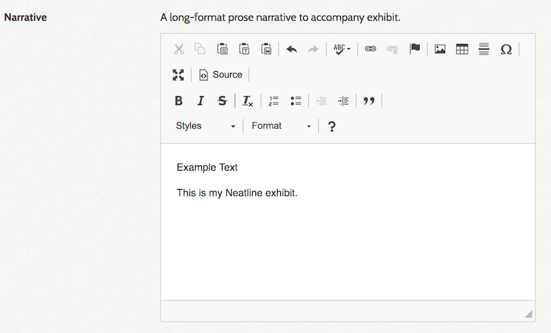
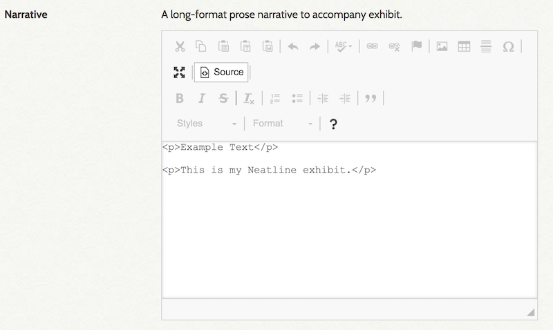
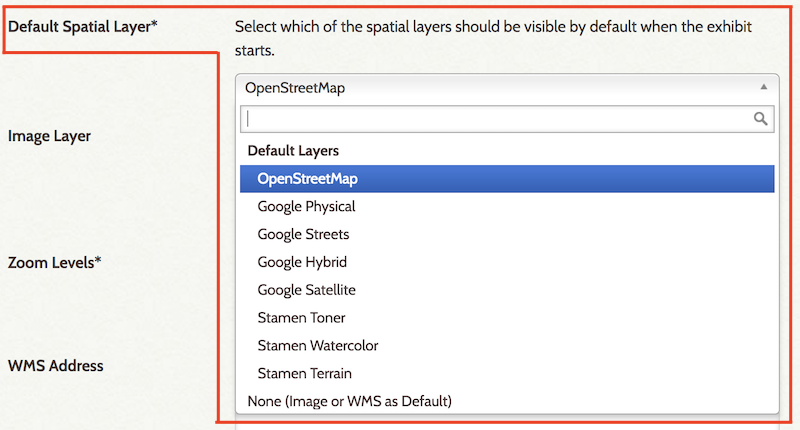

# Creating Exhibits

## At a glance

  - Click "Create an Exhibit" to add a new exhibit.
  - Use the form to define basic, high-level information about a project.
  - You can always go back and edit any of the default settings.

## Exhibit Settings

To start a new project, click on the "Create an Exhibit" button at the top of the main "Browse Exhibits" page. Use the form to define basic information about your project. Setting fields marked with an asterisk (*) are required for saving your new exhibit.

Save your exhibit settings by clicking "Save Exhibit" at the bottom of the page. You can return to **Exhibit Settings** at any time to edit any of the default settings. 

* [Title*](#title)
* [URL Slug*](#url-slug)
* [Narrative](#narrative)
* [Accessible Alternative URL](#accessible-alternative-url)
* [Widgets](#widgets)
* [Enabled Spatial Layers](#enabled-spatial-layers)
* [Default Spatial Layer*](#default-spatial-layer)
* [Image Layer](#image-layer)
* [Zoom Levels*](#zoom-levels)
* [WMS Address and Layers](#wms-address)
* [Spatial Querying](#spatial-querying)
* [Public](#public)

## Title

A top-level identifier for the exhibit, used to label the project in listings of exhibits on the public site.


## URL Slug

A string of letters, numbers, and hyphens used to form the last part of the public-facing URL for the exhibit. For example, if your site is at `http://www.neatline-site.org` and the URL slug for an exhibit is `wordsworth-in-the-alps`, the URL for the public-facing version of the exhibit would be `http://www.neatline-site.org/neatline/show/wordsworth-in-the-alps`.

**Tip**: As a convenience, the URL slug field is linked to the "Title" field, since you'll often want the slug to "resemble" the title - as you type text into the "Title" input, a corresponding value will be automatically generated and inserted into the "Slug" field. For example, if you type "Wordsworth in the Alps" for the title, the slug will automatically read `wordsworth-in-the-alps`. If you want to change the automatic slug (for example, if the title for the exhibit is really long, and you want something shorter for the URL), just manually edit text in the slug field. Once you manually change the automatic value, Neatline assumes that you want to use the value that you entered, and the slug will stop auto-generating if you go back later and make a change to the "Title."


## Narrative

A piece of text to introduce, narrate, accompany, or otherwise generally support the exhibit. This could be anything from a short blurb up to a long-format scholarly essay or a monograph. How you use this field will often depend on how the site theme lays out the public-facing exhibit views - if the narrative is positioned below the exhibit, you might just want a snippet of introductory content; if it's placed to the side of the exhibit and given more room, it might make sense to add more content.  In practice, it often makes sense to modify the theme according to the needs of the project - if you need a lot of supporting text, build the theme to accommodate it.



If needed, you can click on the 'Source' button in the formatting box to view and make edits to the html source code:



**Tip**: The "Narrative" field integrates tightly with the [NeatlineText](working-with-the-text-widget.html) widget, which makes it possible to connect individual paragraphs, sentences, and words in the "Narrative" content with records in the exhibit. For example, if "Narrative" contained markup like this:

```html
... <span data-neatline-slug="paris">Paris</span> ...
```

And you had a record in your Neatline exhibit with a slug of `paris`, the word "Paris" in the narrative would be interactively linked with the location on the map, and vice versa.

## Accessible Alternative URL

An optional field for an alternate public-facing url for the exhibit. This public-facing site should be accessible for screen readers, and provide a complete textual description of the Neatline exhibit.


## Widgets

The combination of user-interface widgets that are "activated" for the exhibit. Since widgets are installed as separate "sub-plugins" in Omeka, there won't be any options available for selection by default. If you've installed the NeatlineWaypoints and NeatlineSimile sub-plugins, though, you'll see two options in the menu that appears when you click the field: "SIMILE Timeline" and "Waypoints." Just click one or both of the options (or neither), and a block will appear in the box, indicating that the widget has been enabled for the exhibit. To remove, click the "x" to the left of the widget name.


For more, see Working with Neatline Plugins: [SIMILE Timeline](working-with-the-simile-timeline-widget.html), [Waypoints](working-with-the-waypoints-plugin.html), [Neatline Text](working-with-the-text-widget.html)

## Enabled Spatial Layers

The base layers that are available in the exhibit. All of these layers will be accessible by way of the "layer switcher" tool displayed in the top right corner of the map in the editing environment and public view. Like with the **Widgets** field, click on the input to display a list of layers, any of which can be clicked and added to the list of selections. To remove, click the "x" to the left of the layer name.


## Default Spatial Layer

The default base layer that's displayed when an exhibit is first accessed. This is an important selection, since the default layer will often strongly influence the visual aesthetic of the exhibit. The default layer selection is OpenStreetMap



For more details on creating map-based exhibits, see [here](map-based-exhibits.html).

## Image Layer

The image url for a static image background layer. For more details on creating image-based exhibits, see [here](image-based-exhibits.html).


## Zoom Levels

The total number of available zoom levels for your exhibit when using a static image background layer. The default zoom level is 20. You can further adjust related exhibit view settings from the [**Styles Tab**](exhibit-styles-tab.html) within the **Exhibit Editor**. 


**Tip:** Consider the size of your static image file when determining zoom levels, as your image may appear pixelated if more zoom levels are provided than the image can handle. 

## WMS Address 

The location of a web-accessible Web Map Service server like Geoserver. This field has to link directly to the WMS API endpoint on the server, such as:

`http://libsvr35.lib.virginia.edu/geoserver/hotchkiss/wms`

**Note:** When using the **WMS Address** and **WMS Layer** fields, select the option 'None (Image or WMS as Deafult)’ for the "Default Spatial Layer." For more details on using these settings to create a custom map default layer, see [here](map-based-exhibits.html#using-a-custom-map-default-layer).

## WMS Layers

The specific WMS layer that you want assigned as the exhibit default spatial layer.


**Note:** Only one WMS Layer can be included in the **Exhibit Settings**, see [Editing Imagery](style-tab-imagery.html) for including multiple custom map layers in your exhibit.

## Spatial Querying

This is selected by default, to continually render you map orientation and visible records. 


## Public

If left unchecked, the exhibit will be visible in the Omeka administrative interface, but not on the public site. Check the box to publish the exhibit to the web. This selection is unchecked (not public) by default. For more, see [Publishing Exhibits](publishing-exhibits.html).


**Related:** [Map-based Exhibits](map-based-exhibits.html), [Image-based Exhibits](image-based-exhibits.html), [Managing Exhibits](managing-exhibits.html), [Managing User Permissions](user-permissions.html), [Publishing Exhibits](publishing-exhibits.html)
